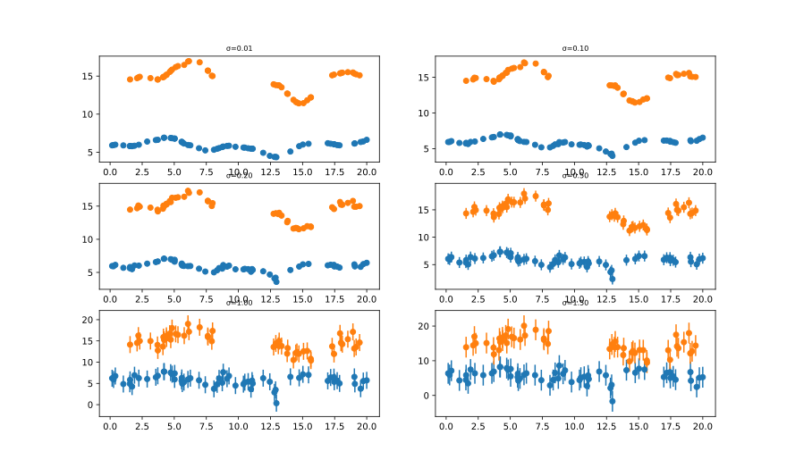
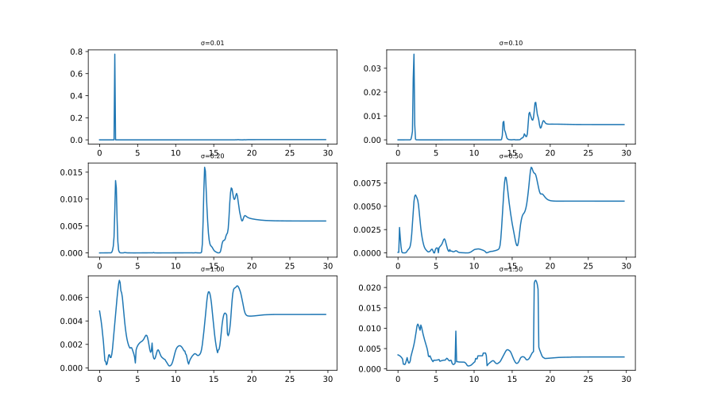
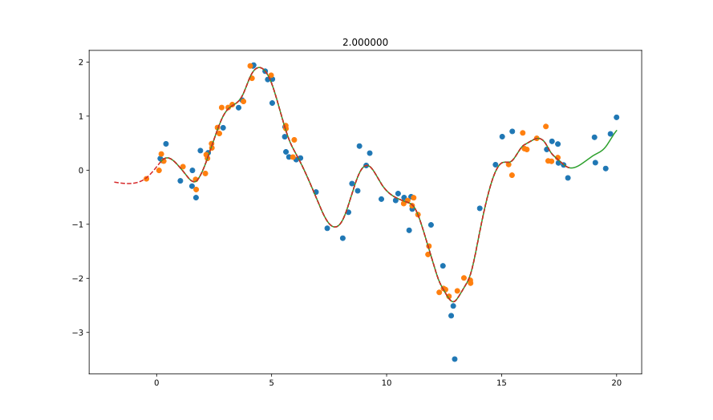

# GPCCPaper

Results obtained with [GPCC.jl](https://github.com/ngiann/GPCC.jl) using data available in [GPCCData.jl](https://github.com/ngiann/GPCCData.jl).

## ▶ Synthetic data drawn from GP with matern32 kernel

We generate synthetic data  that conform to the model with increasing noise levels.We note how various other peaks arise as the noise increases. In the presence of low noise, the true peak at 2 days is the incontestable winner. Beyond that, other peaks start to appear as potential candidates.

Let us look closer at case $\sigma=0.2$. We see that there are two peaks: the true peak at $2$ days and a second higher peak at $\sim 13.8$ days.
We align the light curves according to these two candidate delays. We note that the second peak, which is not the true peak, does lead to a plausible alignment. As even in this synthetic case, where the light curves are related according to the model assumptions, an alternative to the true peak appears as a strong competitor, we are open to the possibility that such "aliases" are common in the search of delays of real light curves too.

## ▶ Virial datasets

#object   | v   |  ev |  mass | emass |  delay|edelay | z     |
| ------- | --- | --- | ----- | ----- | ----- | ----- | ----- |
Mrk335	  |1293 | 64  | 4.6e6 | 0.5e6 | 14.0  |  0.9  | 0.0258| 
Mrk1501   |3321 | 107 | 33.4e6| 4.9e6 | 13.8  |  5.4  | 0.0893|
3C120     |1514 | 65  | 12.2e6| 1.2e6 | 25.6  |  2.4  | 0.0330|
Mrk6      |3714 | 68  | 24.8e6| 2.3e6 | 10.2  |  1.2  | 0.0188|
PG2130099 |1825 | 65  | 8.3e6 | 0.7e6 | 9.7   |  1.3  | 0.0630|

- [Mrk335 with OU kernel](https://rawcdn.githack.com/HITS-AIN/GPCCPaper/4feda60244ee3cab098b74187c50ccb67d75d6c5/plots/Virial/results_GPCC@0.1.24_Mrk335_rho_500_K_OU_Dt_0.025_R_13.jld2_delays_vs_prob.html)
  - [Peak at 13.4](https://rawcdn.githack.com/HITS-AIN/GPCCPaper/1375b5bbfdcc54ab16b2a4c1734cdcdcbefc5e79/plots/Virial/Mrk335_aligned_at_13.4.svg)
  - [Peak at 87.37](https://rawcdn.githack.com/HITS-AIN/GPCCPaper/1375b5bbfdcc54ab16b2a4c1734cdcdcbefc5e79/plots/Virial/Mrk335_aligned_at_87.37.svg)
  - [Peak at 123.25](https://rawcdn.githack.com/HITS-AIN/GPCCPaper/1375b5bbfdcc54ab16b2a4c1734cdcdcbefc5e79/plots/Virial/Mrk335_aligned_at_123.25.svg)
  
  
- [Mrk1501 with OU kernel](https://rawcdn.githack.com/HITS-AIN/GPCCPaper/1e584be3a5d2da7339c37cb1c47746ada994ee51/plots/Virial/results_GPCC@0.1.24_Mrk1501_rho_500_K_OU_Dt_0.025_R_13.jld2_delays_vs_prob.html)
  - [Peak at 18.65](https://rawcdn.githack.com/HITS-AIN/GPCCPaper/0a891bb0e4cf51454c1013debed9874f684ff6bc/plots/Virial/Mrk1501_aligned_at_18.65.svg)
  - [Peak at 59.87](https://rawcdn.githack.com/HITS-AIN/GPCCPaper/1e53546c45b9c9217aae24421ffdb68d5b222d0b/plots/Virial/Mrk1501_aligned_at_59.87.svg)
  
- [3C120 with OU kernel](https://rawcdn.githack.com/HITS-AIN/GPCCPaper/736188d65d26ff672663ef0efa8c126cc69834e2/plots/Virial/results_GPCC@0.1.24_3C120_rho_500_K_OU_Dt_0.025_R_13.jld2_delays_vs_prob.html)
  - [Peak at 27.65](https://rawcdn.githack.com/HITS-AIN/GPCCPaper/e5c16e9580403ff394b7527313513ebba7bffd08/plots/Virial/3C120_aligned_at_27.65.svg)
  - [Peak at 100.55](https://rawcdn.githack.com/HITS-AIN/GPCCPaper/e5c16e9580403ff394b7527313513ebba7bffd08/plots/Virial/3C120_aligned_at_100.55.svg)
  - [Peak at 117.325](https://rawcdn.githack.com/HITS-AIN/GPCCPaper/e5c16e9580403ff394b7527313513ebba7bffd08/plots/Virial/3C120_aligned_at_117.325.svg)

- [Mrk6 with OU kernel](https://rawcdn.githack.com/HITS-AIN/GPCCPaper/4f5d016b7664485814146b63e0b4eb880fe64eab/plots/Virial/results_GPCC@0.1.24_Mrk6_rho_500_K_OU_Dt_0.025_R_13.jld2_delays_vs_prob.html)
  - [Peak at 9.55](https://rawcdn.githack.com/HITS-AIN/GPCCPaper/4f5d016b7664485814146b63e0b4eb880fe64eab/plots/Virial/Mrk6_aligned_at_9.55.svg)
  - [Peak at 117.1](https://rawcdn.githack.com/HITS-AIN/GPCCPaper/4f5d016b7664485814146b63e0b4eb880fe64eab/plots/Virial/Mrk6_aligned_at_117.1.svg)

- [PG2130099 with OU kernel](https://rawcdn.githack.com/HITS-AIN/GPCCPaper/fa6dec7027c45ce424bc1c1702707c0283528ced/plots/Virial/results_GPCC@0.1.24_PG2130099_rho_500_K_OU_Dt_0.025_R_13.jld2_delays_vs_prob.html)
  - [Peak at 10.17](https://rawcdn.githack.com/HITS-AIN/GPCCPaper/fa6dec7027c45ce424bc1c1702707c0283528ced/plots/Virial/PG2130099_aligned_at_10.17.svg)
  - [Peak at 57.27](https://rawcdn.githack.com/HITS-AIN/GPCCPaper/fa6dec7027c45ce424bc1c1702707c0283528ced/plots/Virial/PG2130099_aligned_at_57.27.svg)
  - [Peak at 98.80](https://rawcdn.githack.com/HITS-AIN/GPCCPaper/fa6dec7027c45ce424bc1c1702707c0283528ced/plots/Virial/PG2130099_aligned_at_98.8.svg)

