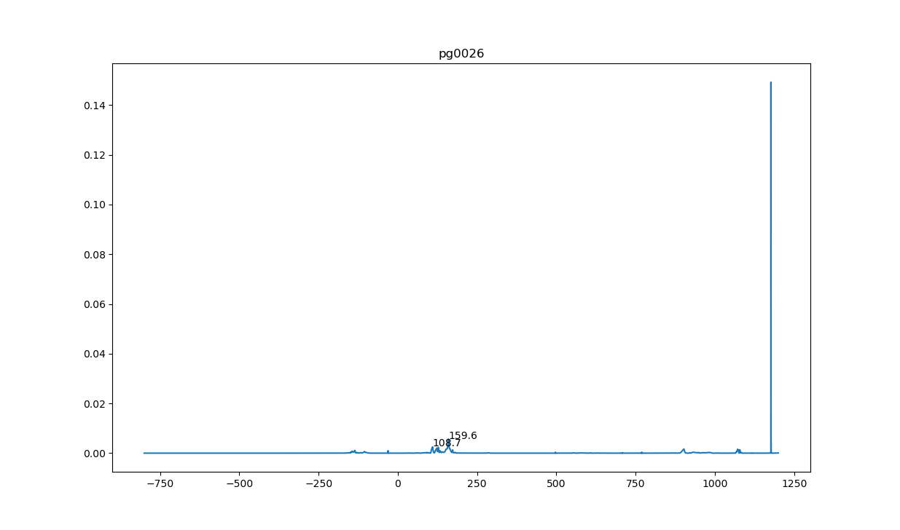
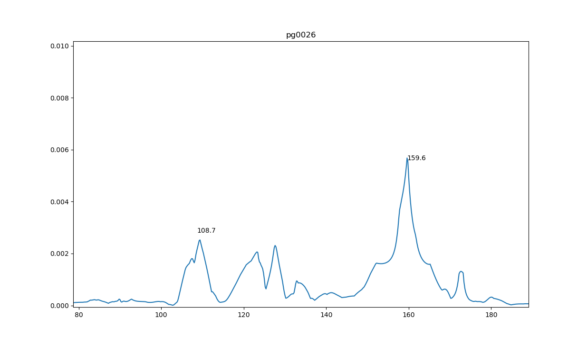
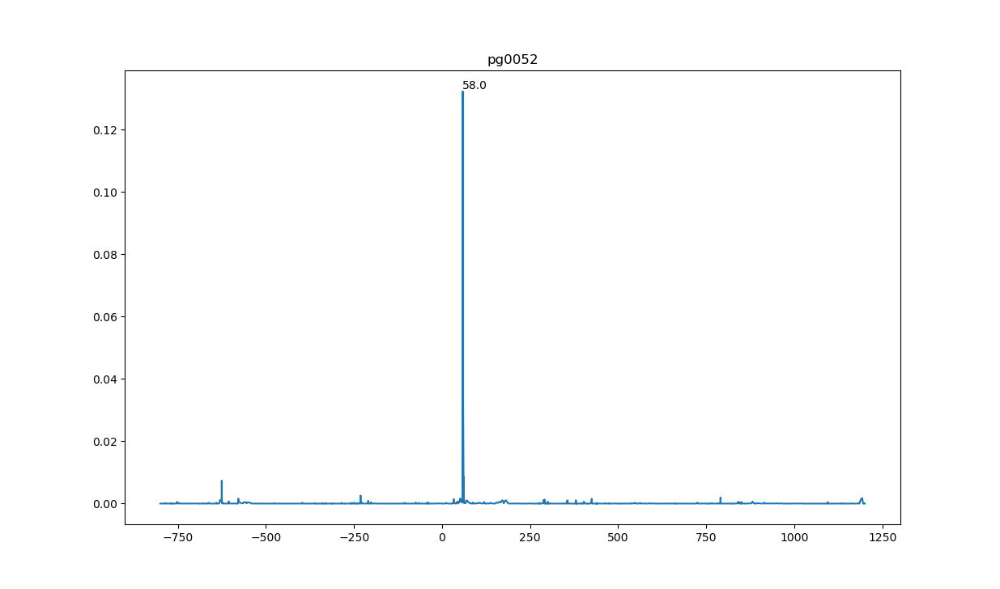
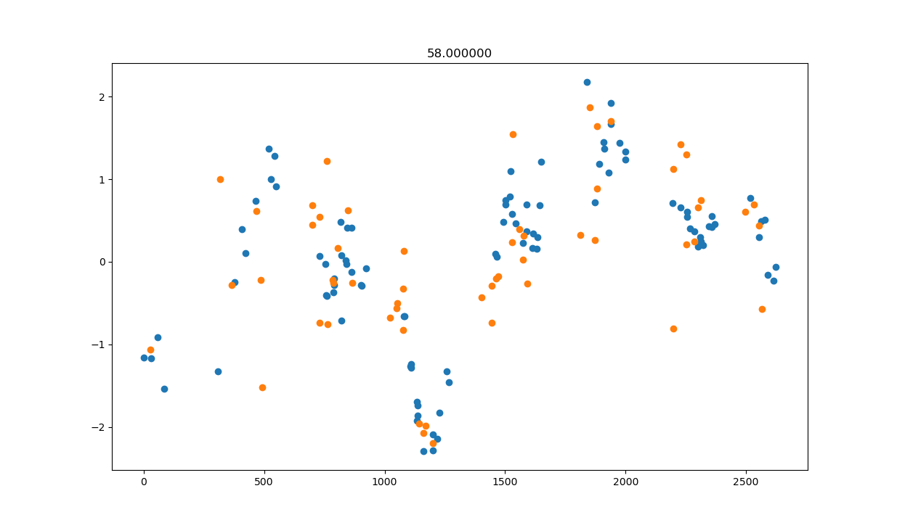
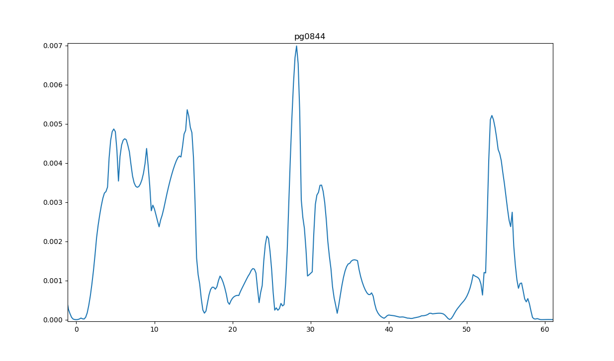

# GPCCPaper

[TESTING](https://rawcdn.githack.com/HITS-AIN/GPCCPaper/87367389fc640430deb9253308415284cc353973/example.html)

## Experiments

### Experiment with synthetic data

We generate synthetic data  that conform to the model with increasing noise levels. Note how spurious peaks arise with increasing noise. In the presence of low noise (up to about σ=1.0), the true peak at 2 days is the incontestable winner. Beyond that, other peaks start to appear as potential candidates.

### PG0026
Using OU kernel

### PG0052
Using OU kernel

### PG0804

Using OU kernel

### PG0844
Using OU kernel

