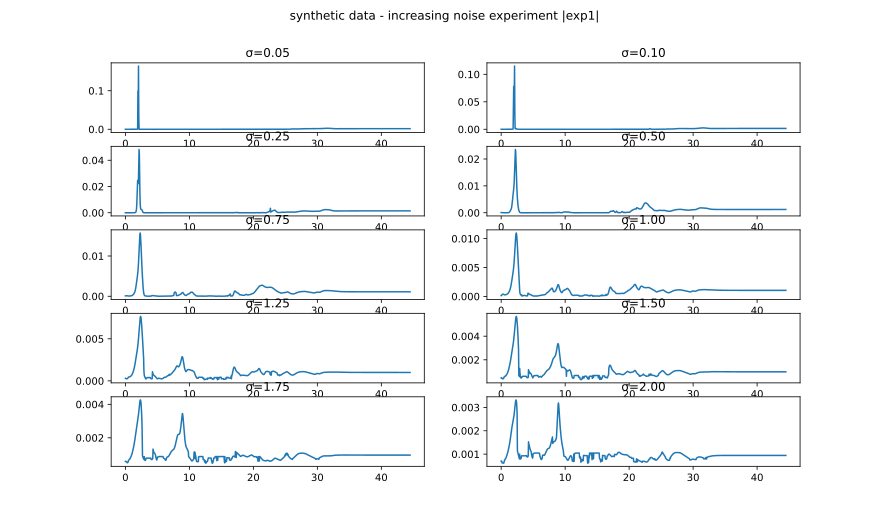

# GPCCPaper

Results obtained with [GPCC.jl](https://github.com/ngiann/GPCC.jl) using data available in [GPCCData.jl](https://github.com/ngiann/GPCCData.jl).

## Experiments

### Experiment with synthetic data

We generate synthetic data  that conform to the model with increasing noise levels. Note how spurious peaks arise with increasing noise. In the presence of low noise (up to about σ=1.0), the true peak at 2 days is the incontestable winner. Beyond that, other peaks start to appear as potential candidates.

### Virial datasets

- [3C120 with OU kernel](https://rawcdn.githack.com/HITS-AIN/GPCCPaper/431c7f0d94779f7a6a638e125d46efd0834b2a74/plots/Virial/results__3C120_rho_10000_K_OU_Dt_0.2_R_13.jld2_delays_vs_prob.html)
- [Mrk1501 with OU kernel](https://rawcdn.githack.com/HITS-AIN/GPCCPaper/431c7f0d94779f7a6a638e125d46efd0834b2a74/plots/Virial/results__Mrk1501_rho_10000_K_OU_Dt_0.2_R_13.jld2_delays_vs_prob.html)
- [Mrk335 with OU kernel](https://rawcdn.githack.com/HITS-AIN/GPCCPaper/431c7f0d94779f7a6a638e125d46efd0834b2a74/plots/Virial/results__Mrk335_rho_10000_K_OU_Dt_0.2_R_13.jld2_delays_vs_prob.html)
- [Mrk6 with OU kernel](https://rawcdn.githack.com/HITS-AIN/GPCCPaper/431c7f0d94779f7a6a638e125d46efd0834b2a74/plots/Virial/results__Mrk6_rho_10000_K_OU_Dt_0.2_R_13.jld2_delays_vs_prob.html)
- [PG2130099 with OU kernel](https://rawcdn.githack.com/HITS-AIN/GPCCPaper/431c7f0d94779f7a6a638e125d46efd0834b2a74/plots/Virial/results__PG2130099_rho_10000_K_OU_Dt_0.2_R_13.jld2_delays_vs_prob.html)
