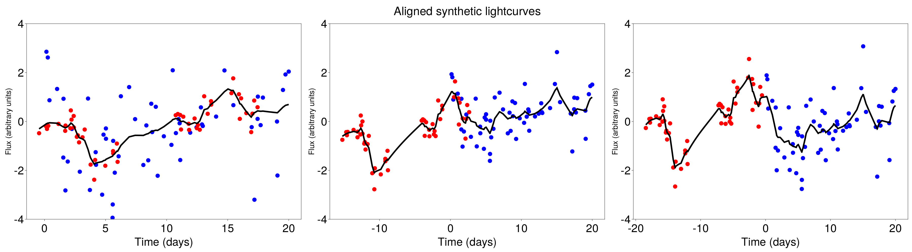

# GPCCPaper

Results obtained with [GPCC.jl](https://github.com/ngiann/GPCC.jl) using data available in [GPCCData.jl](https://github.com/ngiann/GPCCData.jl).

## ▶ Synthetic observations drawn from GP with OU kernel

We generate synthetic data  that conform to the model with increasing noise levels.We note how various other peaks arise as the noise increases. In the presence of low noise, the true peak at 2 days is the incontestable winner. Beyond that, other peaks start to appear as potential candidates.


Let us look closer at case σ=1.0. We see that there is the true peak at two days and large peaks towards the right end of the posterior plot.
We align the light curves according to these two candidate peaks. We note that they also seem to lead to plausible alignments. 




## ▶ Real observations


#object   | v   |  ev |  mass | emass |  delay|edelay | z     | luminosity|
| ------- | --- | --- | ----- | ----- | ----- | ----- | ----- | ----------| 
Mrk335	  |1293 | 64  | 4.6e6 | 0.5e6 | 14.0  |  0.9  | 0.0258| 5.01e43   |
Mrk1501   |3321 | 107 | 33.4e6| 4.9e6 | 13.8  |  5.4  | 0.0893| 2.09e44   |
3C120     |1514 | 65  | 12.2e6| 1.2e6 | 25.6  |  2.4  | 0.0330| 9.12e43   |
Mrk6      |3714 | 68  | 24.8e6| 2.3e6 | 10.2  |  1.2  | 0.0188| 5.62e43   |
PG2130099 |1825 | 65  | 8.3e6 | 0.7e6 | 9.7   |  1.3  | 0.0630| 1.41e44   |

The data can be conveniently accessed [here](https://github.com/HITS-AIN/GPCCData.jl).

### Posterior for 3C120

We obtained the posterior delay for 3C120 using the following:
```
using Distributed
addprocs(16) 
@everywhere using GPCC
@everywhere using ProgressMeter, Suppressor # need to be indepedently installed
using GPCCData
using PyPlot

tobs, yobs, σobs,  = readdataset(source = "3C120");

candidatedelays = collect(0.0:0.2:140)

# warmup 
@showprogress pmap(candidatedelays[1:2*nworkers()]) do delay

    @suppress gpcc(tobs, yobs, σobs; kernel = GPCC.OU, iterations=1,rhomin=0.01, rhomax = 2000, delays = [0; delay], numberofrestarts=1)[1]
    
end

loglikel = @showprogress pmap(candidatedelays) do delay

    @suppress gpcc(tobs, yobs, σobs; kernel = GPCC.OU, iterations=2000, rhomin=0.01, rhomax = 2000, delays = [0; delay], numberofrestarts=7)[1]
    
end;

plot(candidatedelays, getprobabilities(loglikel))

title("posterior delay for 3C120")
```

To obtain posterior delays for other objects, we simply replace 3C120 in `tobs, yobs, σobs,  = readdataset(source = "3C120")` with the name of another object.

### Posterior for Mgc0811, three lightcurves 

We use the following script to obtain the joint posterior of two delays.
```
#using Distributed

#addprocs(8) 

@everywhere using GPCC # make sure GPCC is made available to all workers

@everywhere using ProgressMeter, Suppressor # need to be independently installed

using ADDatasets

using PyPlot # we need this to plot the posterior probabilities, must be independently installed

plt.rc("font", size=30)


candidatedelays = collect(0.0:0.05:20)


lambda, tobs, yobs, σobs = let

    lambda, tobs, yobs, σobs = readdataset(source = "Mgc0811")

    # select indices that correspond to 5100, 7700 and 9100.0
    idx = [6, 4, 5]

    lambda[idx], tobs[idx], yobs[idx], σobs[idx]

end


# warmup

let 
    for i in 1:2
        @showprogress pmap(d2 -> map(d1 -> (@suppress gpcc(tobs, yobs, σobs; kernel = GPCC.matern32, delays = [0;d1;d2], iterations = 10, rhomax = 300)[1]), candidatedelays[1:10]), candidatedelays[1:2*nworkers()]);
    end
end

out = @showprogress pmap(d2 -> map(d1 -> (@suppress gpcc(tobs, yobs, σobs; kernel = GPCC.matern32, delays = [0;d1;d2], iterations = 2000, rhomax = 2000)[1]), candidatedelays), candidatedelays);

posterior = getprobabilities(reduce(vcat, out));

posterior = reshape(posterior, length(candidatedelays), length(candidatedelays));

figure()
subplot(311)
title("joint posterior")
pcolor(candidatedelays,candidatedelays,posterior)
ylabel("7700"); xlabel("9100")

subplot(312)
title("marginal posterior for 7700")
plot(candidatedelays,vec(sum(posterior,dims=2)), lw=4)

subplot(313)
title("marginal posterior for 9100")
plot(candidatedelays,vec(sum(posterior,dims=1)), lw = 4)

```


