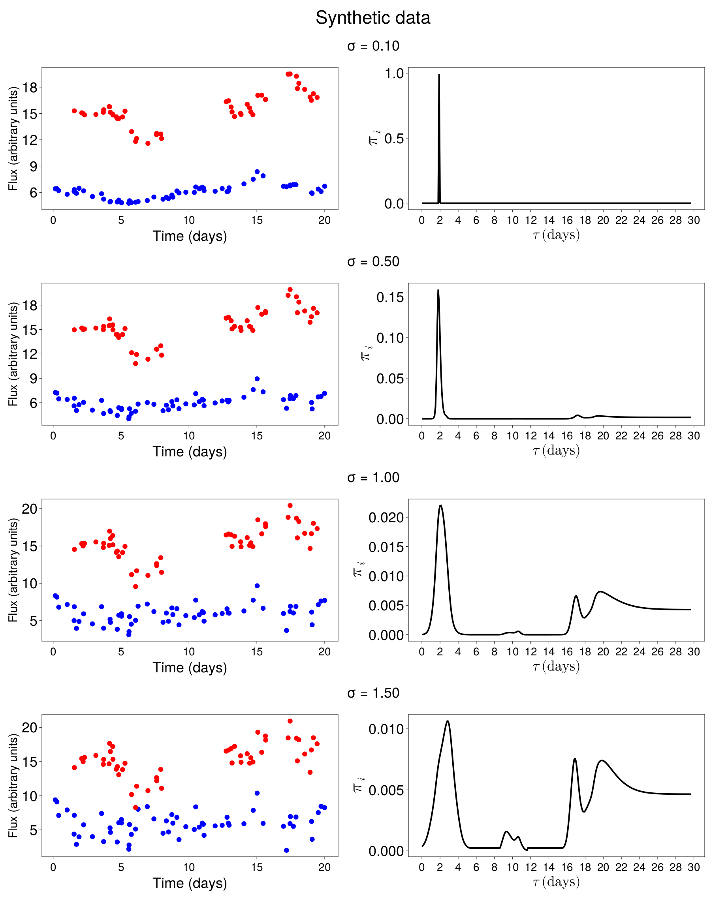
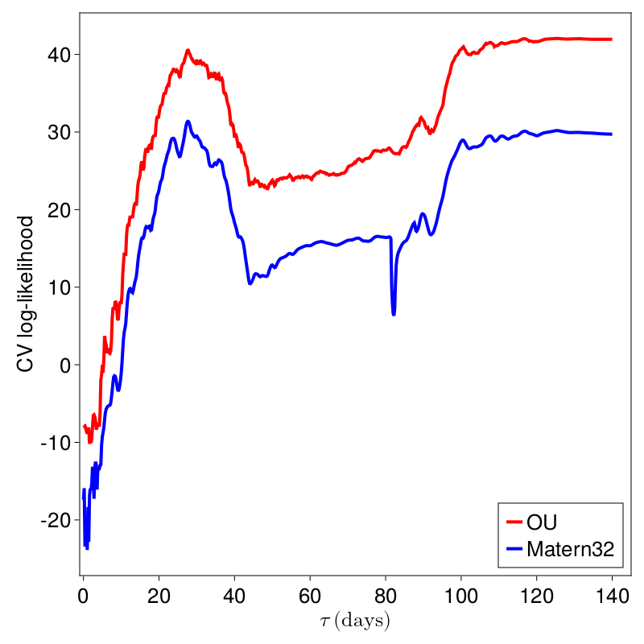
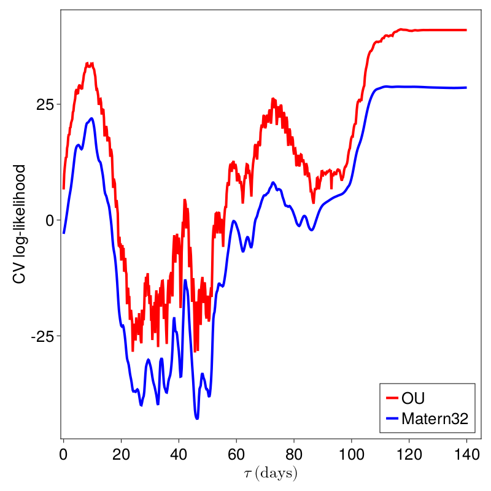

# GPCCPaper

## ℹ What is this?

This repository contains scripts for reproducing all the results presented in 

*A Gaussian process cross-correlation approach to time delay estimation for reverberation mapping of active galactic nuclei*

using the implementation at [GPCC.jl](https://github.com/HITS-AIN/GPCC.jl) and the data available at [GPCCData.jl](https://github.com/HITS-AIN/GPCCData.jl).

To reproduce the results you will need to add the [AINJuliaRegistry](https://github.com/HITS-AIN/AINJuliaRegistry).

## ▶ Synthetic observations drawn from GP with OU kernel

We generate synthetic data  that conform to the model with increasing noise levels.We note how various other peaks arise as the noise increases. In the presence of low noise, the true peak at 2 days is the incontestable winner. Beyond that, other peaks start to appear as potential candidates.

Let us look closer at case σ=1.0. We see that there is the true peak at two days and large peaks towards the right end of the posterior plot.
We align the light curves according to these two candidate peaks. We note that they also seem to lead to plausible alignments. 

These synthetic experiments can be reproduced following instructions [here](scripts/Synthetic/README.md) and the code located in the corresponding folder.

## ▶ Real observations

#object   | v   |  ev |  mass | emass |  delay|edelay | z     | luminosity|
| ------- | --- | --- | ----- | ----- | ----- | ----- | ----- | ----------| 
Mrk335	  |1293 | 64  | 4.6e6 | 0.5e6 | 14.0  |  0.9  | 0.0258| 5.01e43   |
Mrk1501   |3321 | 107 | 33.4e6| 4.9e6 | 13.8  |  5.4  | 0.0893| 2.09e44   |
3C120     |1514 | 65  | 12.2e6| 1.2e6 | 25.6  |  2.4  | 0.0330| 9.12e43   |
Mrk6      |3714 | 68  | 24.8e6| 2.3e6 | 10.2  |  1.2  | 0.0188| 5.62e43   |
PG2130099 |1825 | 65  | 8.3e6 | 0.7e6 | 9.7   |  1.3  | 0.0630| 1.41e44   |

The data can be conveniently accessed [here](https://github.com/HITS-AIN/GPCCData.jl).

We compute the following posteriors:

The above results can be reproduced by following the instructions [here](scripts/GPCCDataExperiments/README.md).

## ▶ Three lightcurve experiment, posterior for Mgc0811

We compute the following posteriors:

The above results can be reproduced by following the instructions [here](scripts/threelightcurves/README.md).

## ▶ Kernel selection via cross-validation

The proposed GPCC model delivers out-of-sample predictions. It can be subjected to model selection in a cross-validation framework, where a criterion measures the discrepancy of predictions on held out test data. This allows us to compare GPCC to other models. It also allows us to select the kernel function.

The above results can be reproduced by following the instructions [here](scripts/kernelselection/README.md).

## ▶ ESO399-IG20
