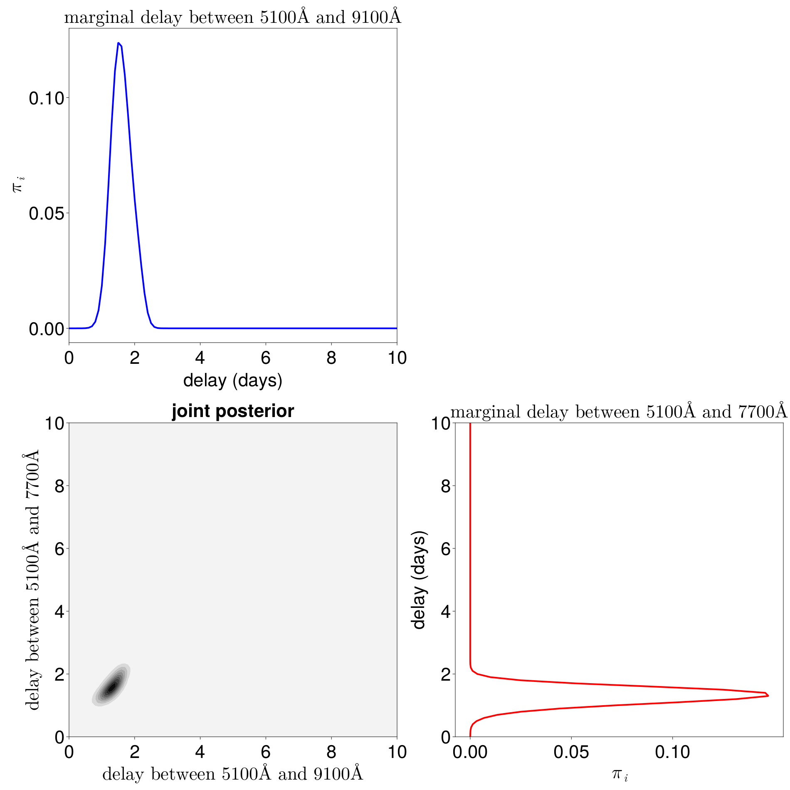
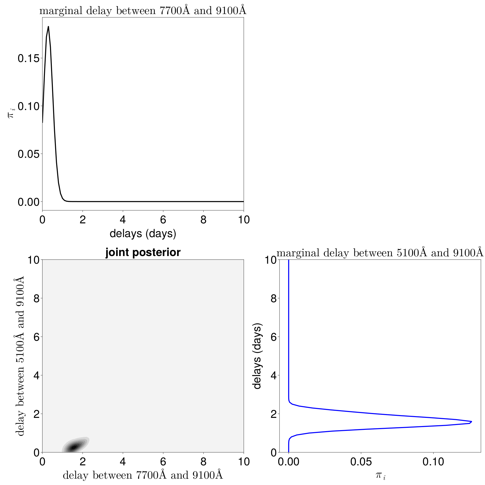
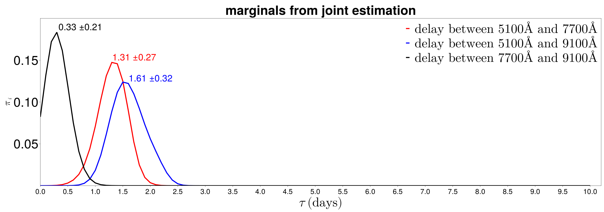

### Contents of directory

This directory contains code that reproduces the results and plots for the synthetic simulations.

The code reproduces the following plots:






### Installing relevant packages

If the Julia packages necessary for running these scripts are not present in your system, you can install them by:

1. Starting Julia in the directory where the scripts are located.
2. Switch to package mode with `]` and activate the local environment with `activate .`
3. Still within package model execute ``instantiate``.

It may take considerable time for Julia to install the necessary packages.

### Running the scripts

The scripts below should take care of  computing the results and creating plots.


By simply using in the julia REPL:
```
include("runme_joint.jl") # calculates joint posterior delay
include("runme_pairwise.jl") # calculates pairwise delays
```
you will compute all the posterior delay distributions. 
The results will be saved in files that use the JLD2 format.

❗ This is a lengthy computation, best run on a larger number of workers, preferrably in a cluster environment!


Once the results have been computed and saved, by using in the julia REPL:
```
include("runme_createplots_joint.jl")           # joint posterior plot with respect to light curve at 5100
include("runme_createplots_joint_reorder.jl")   # joint posterior plot with respect to light curve at 9100
include("runme_createplots_joint_marginals.jl") # plot of marginals calculated from joint posterior
include("runme_createplots_pairwise.jl")        # plot of delays estimated in pairwise manner
```
it should be possible to recreate the plots that shows the posterior delay distributions in the paper.
